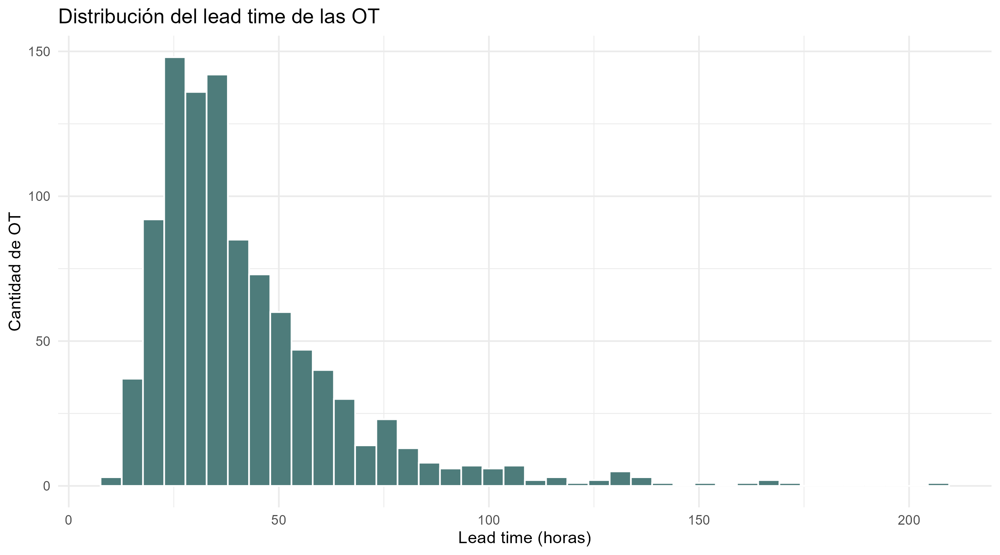
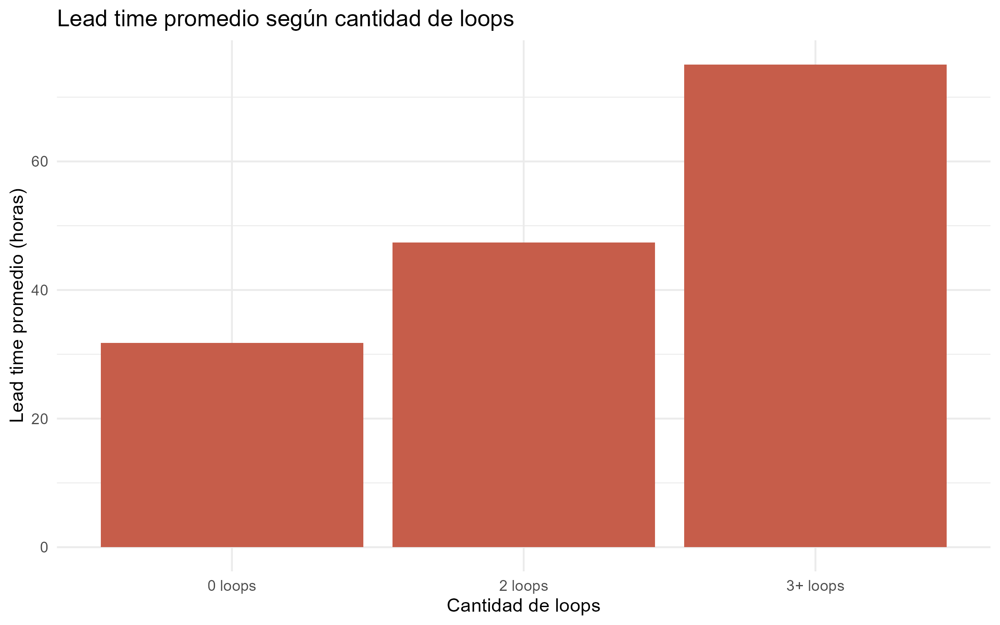
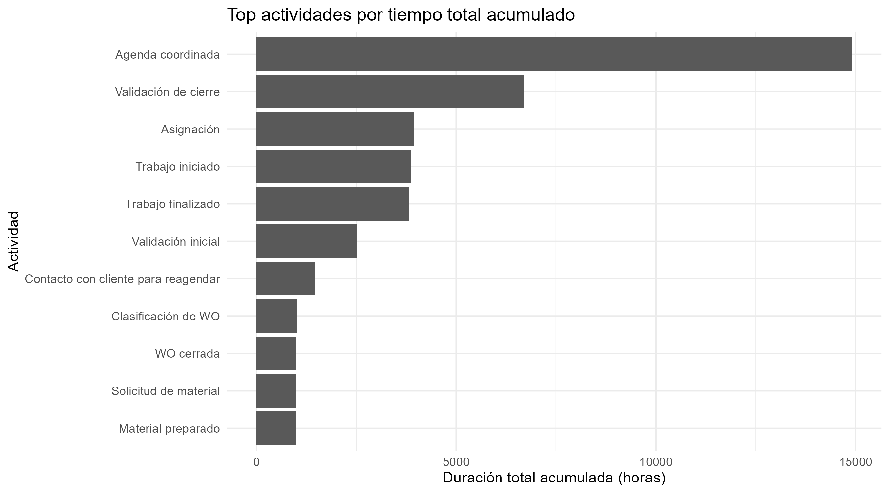
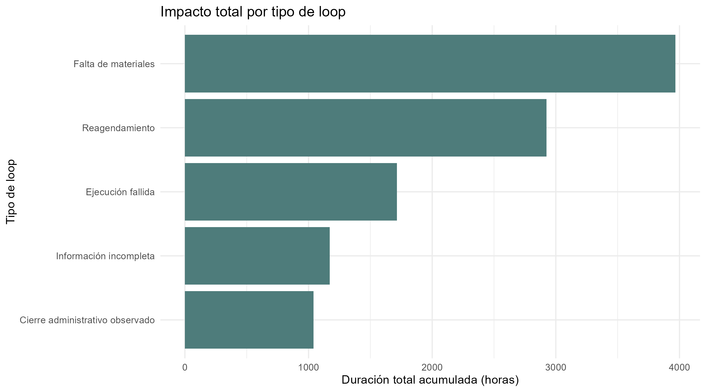
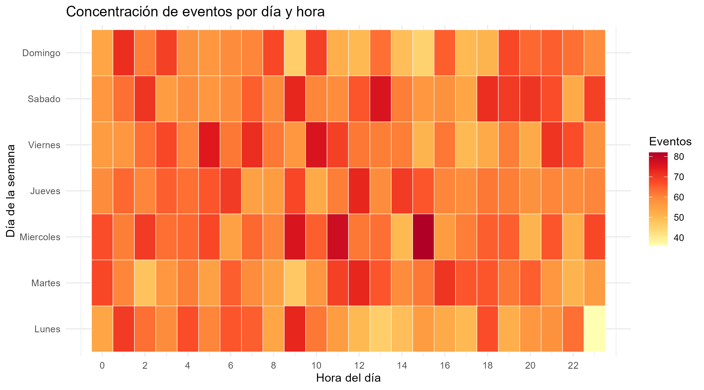
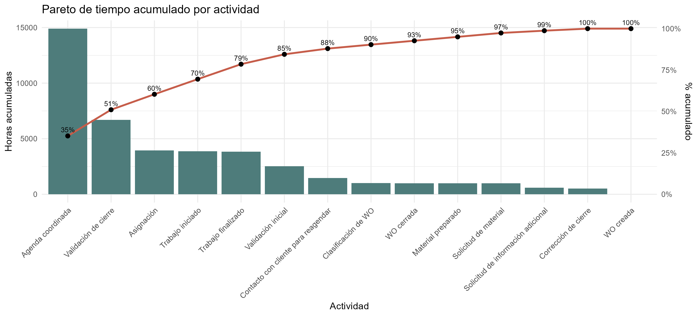
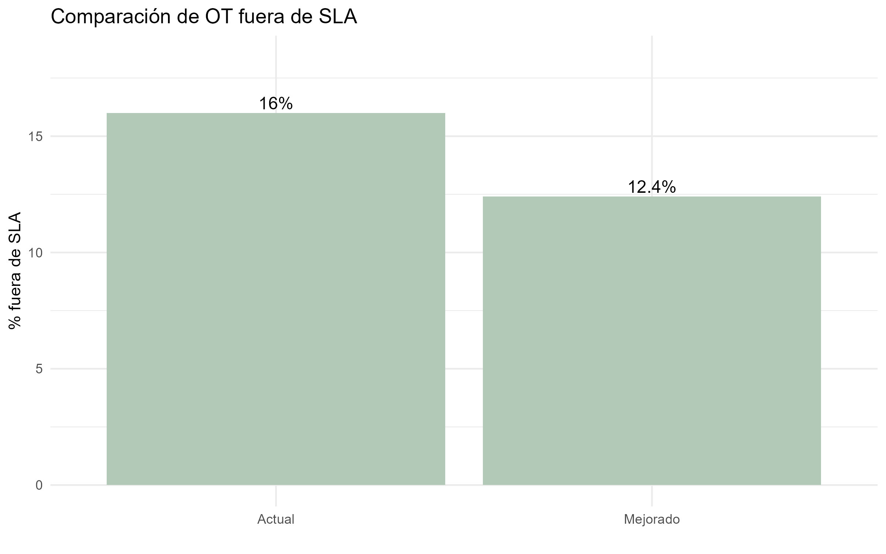
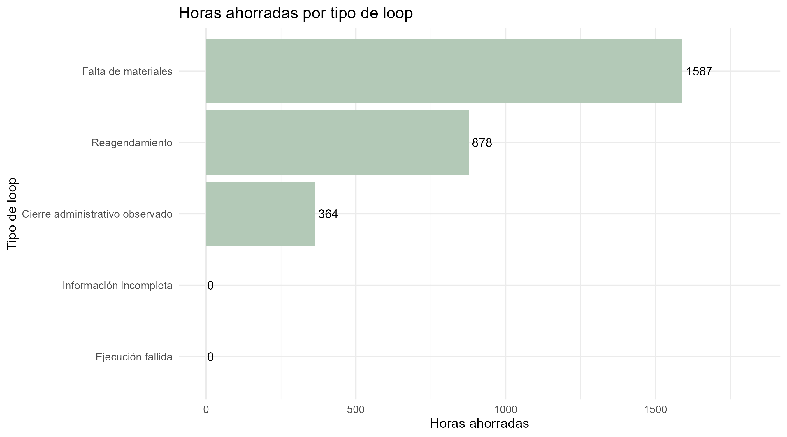

# Detección de Ineficiencias Operativas en Órdenes de Trabajo

## Process Mining aplicado a operaciones de servicio

Este proyecto presenta un análisis de procesos operativos basado en *event logs* de órdenes de trabajo (OT), utilizando técnicas de **Process Mining**, análisis operacional y simulación de mejoras.

La idea del proyecto surge a partir de una experiencia real observada en operaciones de servicio técnico, donde existían demoras, reprocesos y problemas de coordinación entre áreas que impactaban directamente sobre el cumplimiento de SLA y los tiempos de resolución.

A partir de esa experiencia, se buscó responder preguntas como:

* ¿Dónde se generan realmente las demoras?
* ¿Qué actividades consumen más tiempo?
* ¿Qué loops o reprocesos impactan más sobre el SLA?
* ¿Qué parte del problema proviene de coordinación y no de ejecución técnica?
* ¿Qué mejoras podrían generar mayor impacto operativo?

El proyecto busca mostrar cómo un simple *event log* puede transformarse en una herramienta de diagnóstico operativo y soporte para iniciativas de mejora continua.

---

# 📊 Reporte interactivo

👉 **[Abrir análisis completo](https://dieguearau.github.io/ProMiningOperativo/)**

---

# Objetivos del proyecto

El análisis se enfoca en:

* reconstruir el flujo operativo completo de las órdenes de trabajo;
* identificar loops y reprocesos;
* detectar cuellos de botella;
* analizar lead time y cumplimiento de SLA;
* medir impacto por tipo de ineficiencia;
* visualizar concentración temporal de carga operativa;
* priorizar oportunidades de mejora;
* simular escenarios operativos mejorados.

---

# Tecnologías utilizadas

<p align="left">


</p>

(el proyecto fue desarrollado en `R` debido a que el caso original y gran parte del ecosistema analítico utilizado en el contexto operativo ya se encontraban implementados en dicho lenguaje, sin embargo, el enfoque y la lógica del proyecto son completamente reproducibles en `Python`).

---

# Estructura del proyecto

```text
Proyecto/
│
├── datos/
│
├── docs/
│   └── index.qmd
│
├── outputs/
│   ├── graficos/
│   ├── html/
│   └── tablas/
│
├── scripts/
│   ├── eventlogs_simulacion.R
│   ├── eventlogs_analisis.R
│   ├── simulacion_mejoras.R
│   └── run_process.R
│
└── README.md
```

---

# ⚠️ Disclaimer de datos

Este repositorio **no utiliza event logs reales**.

Con el objetivo de preservar confidencialidad y evitar exposición de información operativa sensible, se desarrolló un script de simulación llamado:

```r
eventlogs_simulacion.R
```

Este script genera artificialmente un flujo completo de órdenes de trabajo incluyendo:

* actividades;
* timestamps;
* áreas involucradas;
* usuarios;
* SLA;
* loops operativos;
* reprocesos;
* reagendamientos;
* problemas de materiales;
* validaciones administrativas.

La simulación fue diseñada para representar comportamientos operativos realistas observados en procesos de servicio técnico.

---

# Principales análisis realizados

## Distribución del lead time

Se analiza el tiempo total transcurrido desde la creación hasta el cierre de cada OT.

<p align="center">

</p>

El análisis permite detectar dispersión operativa, casos extremos y órdenes con tiempos de resolución anormalmente altos.

---

## Impacto de loops operativos

Se compara el desempeño de órdenes con y sin reprocesos.

<p align="center">

</p>

Los resultados muestran que los loops representan uno de los principales factores de incremento del lead time y deterioro del SLA.

---

## Cuellos de botella por actividad

Se identifican las actividades que concentran mayor tiempo acumulado.

<p align="center">

</p>

El análisis revela que gran parte del tiempo consumido proviene de coordinación y validaciones, más que de la ejecución técnica en sí misma.

---

## Impacto por tipo de loop

Se cuantifica qué tipos de reproceso generan mayor impacto operativo.

<p align="center">

</p>

Los loops asociados a materiales y reagendamientos concentran la mayor parte del tiempo perdido.

---

## Concentración temporal de eventos

Análisis de carga operativa por día y hora.

<p align="center">

</p>

Esto permite detectar posibles ventanas de saturación operativa y oportunidades de redistribución de capacidad.

---

## Pareto de tiempo por actividad

Priorización de actividades según impacto acumulado.

<p align="center">

</p>

Un subconjunto reducido de actividades explica gran parte del tiempo total del proceso.

---

## Simulación de mejoras operativas

El proyecto incorpora una simulación de escenario mejorado para estimar impacto potencial antes de implementar cambios reales.

<p align="center">

</p>

<p align="center">

</p>

Las mejoras simuladas incluyen:

* reducción de reagendamientos;
* disminución de loops por materiales;
* optimización de validaciones;
* reducción de tiempos de coordinación.

---

# Principales hallazgos

* Los loops operativos representan una de las principales fuentes de ineficiencia.
* Gran parte del lead time proviene de coordinación y espera, no de trabajo técnico efectivo.
* Los problemas de materiales y reagendamientos generan alto impacto acumulado.
* El análisis de percentiles permite detectar comportamientos extremos invisibles en los promedios.
* Pequeñas mejoras focalizadas pueden generar reducciones relevantes sobre SLA y horas consumidas.

---

# Cómo ejecutar el proyecto

Desde el directorio principal ejecutar:

```r
source("scripts/run_process.R")
```

El pipeline:

1. genera los event logs simulados;
2. ejecuta análisis operacionales;
3. genera visualizaciones;
4. ejecuta simulación de mejoras;
5. renderiza automáticamente el reporte en Quarto.

---

# Reporte final

El reporte completo se genera automáticamente en formato HTML utilizando Quarto:

```text
reporte/reporte_proceso_ot.html
```

---

# Posibles aplicaciones

El enfoque puede adaptarse a:

* soporte técnico;
* mantenimiento;
* logística;
* service desk;
* workflows administrativos;
* gestión de tickets;
* atención al cliente;
* procesos internos corporativos.

---

# Autor

**Diego Araujo**

Licenciado en Estadística
Data Analytics | Process Mining | Optimización Operativa | IA Aplicada | R Programming
